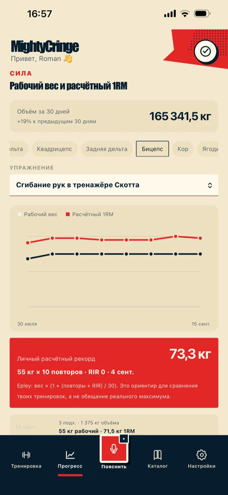

# MightyCringe

Offline-first PWA for strength training: workout logging, exercise catalog, progress, voice
capture and read-only coach access.

## About the project

MightyCringe is a gym app built around one rule: in the gym the app must not get in the way of the
training. Log a set in a couple of taps — or just say it out loud — and get back to the bar.
Everything is recorded locally first and synced afterwards, so a dead spot in the basement gym
does not cost you a workout.

The name comes from a private joke. Every exercise is tagged as one of three kinds:

| Tag           | RU           | What it means                                            |
| ------------- | ------------ | -------------------------------------------------------- |
| ⚡ **Mighty** | Эпичные      | The heroic lifts — the ones that make you feel strong.   |
| • **Normal**  | Обычные      | The honest working volume that actually builds the body. |
| 😬 **Cringe** | Унизительные | The humbling accessory work that fixes your weak points. |

What it does:

- **Workout logging** — a plan for today with supersets, sets logged as weight × reps × RIR.
- **Voice capture** — dictate a set instead of typing; transcription is processed server-side.
- **Progress** — training calendar and streak, working weight and estimated 1RM (Epley with RIR)
  per muscle group and per exercise, body measurements and full history.
- **Exercise catalog** — shared plus personal, filtered by muscle group and by tag; unknown
  exercise names can be researched online and saved to your own catalog with technique notes.
- **Coach access** — read-only view of an athlete's workouts and measurements, by invitation.

The interface is in Russian.

## Screenshots

<table>
  <tr>
    <td width="33%"></td>
    <td width="33%"></td>
    <td width="33%"></td>
  </tr>
  <tr>
    <td align="center"><b>Workout</b><br>plan for today</td>
    <td align="center"><b>Progress</b><br>calendar and streak</td>
    <td align="center"><b>Strength</b><br>working weight and 1RM</td>
  </tr>
  <tr>
    <td></td>
    <td></td>
    <td></td>
  </tr>
  <tr>
    <td align="center"><b>Catalog</b><br>shared and personal</td>
    <td align="center"><b>Exercise</b><br>technique and video</td>
    <td align="center"><b>About</b><br>the joke, explained</td>
  </tr>
</table>

## Install on your phone

MightyCringe is a PWA: there is no App Store or Play Store build. Add it to the home screen and it
runs full-screen like a native app, keeps you signed in, and works offline.

**iPhone / iPad — Safari only.** Chrome and Firefox on iOS cannot install a PWA.

1. Open `https://mightycringe.com` in **Safari**.
2. Sign in with Google.
3. Tap **Share** (the square with an arrow) in the bottom bar.
4. Scroll down, tap **Add to Home Screen** → **Add**.
5. Launch the app from the new icon, not from Safari — push notifications on iOS only work from the
   installed icon.

**Android — Chrome.**

1. Open `https://mightycringe.com` in **Chrome**.
2. Sign in with Google.
3. Tap **⋮** → **Add to Home screen** (or **Install app**), then confirm.

**Desktop — Chrome or Edge.** Open the same address and use the install icon at the right of the
address bar.

Sets and measurements are written locally and pushed to the server through a durable ordered
outbox, so logging keeps working without a connection and syncs when the network comes back.

## Repository layout

- `apps/web` — React PWA.
- `apps/api` — Fastify API and authorization boundary.
- `apps/worker` — asynchronous work: voice processing, push and retries.
- `packages/contracts` — API contracts and shared domain types.
- `packages/db` — PostgreSQL schema and Drizzle migrations.
- `infra/production` — production Docker Compose and Caddy configuration.

## Local development

```bash
corepack enable
pnpm install --frozen-lockfile
pnpm local:doctor
pnpm local:dev
```

The frontend is served at `http://localhost:5173`; the API at `http://localhost:3000`.
The local command starts PostgreSQL in an isolated Docker Compose project or native `.local`
directory, applies migrations, and runs the PWA, API and worker on the host with hot reload. It
explicitly enables a development athlete without production OAuth credentials; the API ignores this
flag in production. Data is preserved across restarts. See the
[local runbook](docs/development/local-environment.md) for stop, status, reset and pre-merge
acceptance commands.

Plain `pnpm dev` remains available for deliberately limited in-memory development, but it is not the
pre-merge acceptance path.

## Production target

- `mightycringe.com` — PWA and API under `/api`.
- Hetzner Cloud, Helsinki, x86 cost-optimized instance.
- PostgreSQL on the private Docker network.
- Private Hetzner Object Storage bucket in Helsinki for raw audio and encrypted backups.

See [ADR 0001](docs/adr/0001-production-platform.md) for the decision and
[production README](infra/production/README.md) for deployment prerequisites.

## Current implementation boundary

The application includes local-first workout and measurement flows, deterministic typed commands,
Google OIDC sessions, trainer read-only access, private queued voice processing, opt-in push, and a
durable ordered outbox with explicit revision conflicts. Provider-backed voice and push remain
disabled until their complete production credential groups are configured. Unknown exercise names
can be researched through a server-side, citation-grounded search, explicitly confirmed, and saved
to the authenticated user's personal catalog. This search remains disabled until the server has
`OPENROUTER_API_KEY` and `EXERCISE_DISCOVERY_MODEL`.
