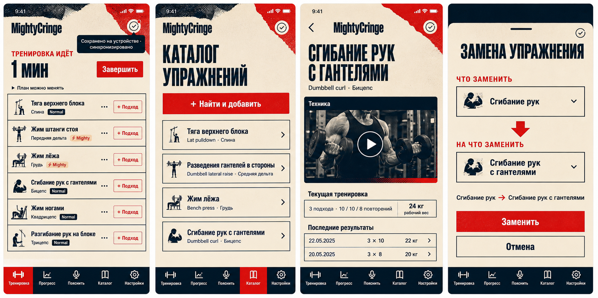

# MightyCringe — editorial UI concept

**Статус:** принят владельцем 2026-07-26.

## Визуальная система

- тёплый кремовый фон `#f4e8cf`;
- глубокий navy `#071d2d` для текста, контуров и нижней навигации;
- сигнальный красный `#e32626` для основных действий и состояний внимания;
- тяжёлая condensed-типографика в заголовках и спокойный системный sans-serif в данных;
- резкие печатные блоки, ограниченный halftone и бумажная фактура только в декоративных областях;
- чистые однотонные поверхности вокруг значений, истории, полей и touch-target.

### Иерархия без лишних рамок

- обычные карточки, строки и вложенные значения группируются заливкой, отступами и тонкими
  разделителями, а не повторяющимися navy-контурами;
- сильный контур используется только для фокуса, выбранного состояния, ошибки, конфликта или
  отдельного брендового акцента;
- основные кнопки читаются по сплошной красной заливке, вторичные — по спокойной кремовой заливке,
  без дополнительной рамки вокруг каждой из них;
- поля ввода обозначаются контрастной нижней линией и явным focus-состоянием вместо постоянной
  рамки со всех четырёх сторон;
- вложенные поверхности не дублируют контур родительского контейнера: один визуальный уровень —
  один способ группировки.

## Принятые UX-решения

- название продукта в пользовательском интерфейсе — `MightyCringe`;
- статус синхронизации занимает одну иконку, а по нажатию объясняет локальное сохранение,
  очередь, offline, ошибку или успешную синхронизацию;
- активная тренировка показывает полные названия упражнений и шесть компактных строк в viewport
  390×844;
- карточка каталога целиком открывает страницу упражнения; видео и ссылки на него отсутствуют в
  каталоге;
- закреплённое видео техники находится только на странице упражнения и запускается внутри PWA;
- замена использует крупные подписи «Что заменить» и «На что заменить» в ручном и natural-text
  сценариях.
- один или два записанных подхода сохраняют компактную ширину и не растягиваются на всю карточку;
- сводка даты и длительности при редактировании истории остаётся одной компактной строкой на
  основном мобильном размере;
- личные оценки упражнения в каталоге показываются соседними touch-target, а не отдельной
  вертикальной полосой.
- ссылка «О приложении» в заголовке настроек остаётся вторичной, но использует читаемый размер и
  полноценный touch-target.

## Ограничения

- декоративные фактуры не накладываются на формы, значения и текст;
- основные действия сохраняют touch-target не меньше 44 px;
- offline, error, conflict и destructive-состояния различаются иконкой и текстом, а не только
  цветом;
- интерфейс не использует purple, glassmorphism, тяжёлые тени и декоративные изображения в
  прокручиваемом списке тренировки.
